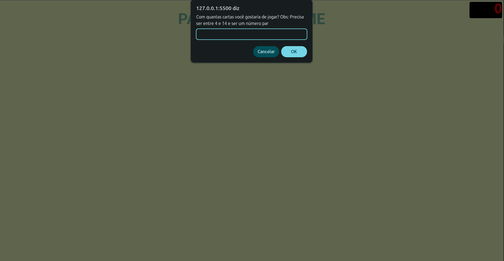
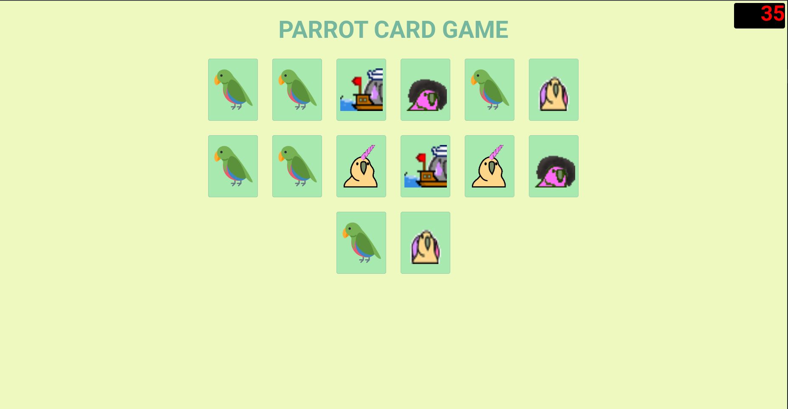
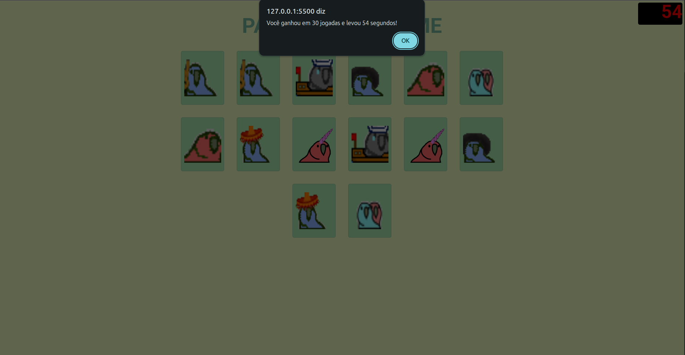

# 🧠 Parrot Memory Game


🇺🇸 A simple and interactive memory game built with HTML, CSS and JavaScript  
🔽 🇧🇷 Versão em português abaixo

## 🎮 About the Game

This project is a classic memory matching game where players test their concentration and recall skills.

- 🃏 Choose the number of cards through a pop-up at the start
- ⏱️ Track your performance with a timer displayed on the top-right corner
- 🧩 Match all pairs to complete the game
- 🦜 Cards feature parrots with different expressions

The game ends when all matching pairs have been successfully found.

---

## 🚀 Purpose

This project was developed to practice and reinforce:

- 🌐 HTML structure and semantics  
- 🎨 CSS styling and layout  
- ⚙️ JavaScript logic and DOM manipulation  
- 🧱 Core web development principles  

---

## 📸 Features

- Dynamic card generation based on user input  
- Real-time game timer  
- Simple and responsive interface  
- Fun visual theme with expressive parrot illustrations  

---

## 📸 Game Preview

| Start | Gameplay | Completed |
|------|--------|-----------|
|  |  |  |

---

## ▶️ How to Run

**1. Clone this repository:**
```bash
git clone https://github.com/JorgeMalaquiasDev/parrots-game.git
```
**2. Open the project folder**

**3. Run the project using one of the options:**
- **Option 1: Open directly in browser**
    - Open the index.html file in your browser
- **Option 2: Using Live Server (recommended)**
    - Install the Live Server extension in VS Code
    - Right-click index.html
    - Click "Open with Live Server"

---

## 🛠️ Technologies Used

- HTML5  
- CSS3
- JavaScript (Vanilla)  

---

## 📦 Project Background

This project was originally created in a previous GitHub account and later migrated and improved in this repository.

---

## 🎓 Learning Context

This project was developed as part of my learning journey in front-end development.

It focuses on applying core concepts such as DOM manipulation, dynamic rendering, and interactive UI behavior, while reinforcing fundamental web development principles.

Although simple in scope, it reflects my effort to build solid foundations and continuously improve my development skills.

## 🇧🇷 Português

### 🧠 Jogo da Memória dos Papagaios

Um jogo da memória simples e interativo desenvolvido com **HTML, CSS e JavaScript**.

---

### 🎮 Sobre o Jogo

Este projeto é um clássico jogo da memória onde o jogador testa sua concentração e capacidade de memorização.

- 🃏 Escolha a quantidade de cartas por meio de um pop-up no início do jogo  
- ⏱️ Acompanhe seu desempenho com um cronômetro exibido no canto superior direito  
- 🧩 Encontre todos os pares para completar o jogo  
- 🦜 As cartas possuem ilustrações de papagaios com diferentes expressões  

O jogo é finalizado quando todos os pares são encontrados com sucesso.

---

### 🚀 Objetivo

Este projeto foi desenvolvido com o objetivo de praticar e reforçar:

- 🌐 Estrutura e semântica em HTML  
- 🎨 Estilização e layout com CSS  
- ⚙️ Lógica em JavaScript e manipulação do DOM  
- 🧱 Princípios fundamentais de desenvolvimento web  

---

### 📸 Funcionalidades

- Geração dinâmica de cartas com base na escolha do usuário  
- Cronômetro em tempo real  
- Interface simples e responsiva  
- Tema visual leve com papagaios expressivos  

---

## ▶️ Como executar

**1. Clone o repositório:**
```bash
git clone https://github.com/JorgeMalaquiasDev/parrots-game.git
```
**2. Abra a pasta do projeto**

**3. Execute o projeto de uma das formas::**
- **Opção 1: Abrir direto no navegador**
    - Abra o arquivo index.html no navegador
- **Opção 2: Usando Live Server (recomendado)**
    - Instale a extensão Live Server no VS Code
    - Clique com o botão direito no index.html
    - Clique em "Open with Live Server"

---

### 🛠️ Tecnologias Utilizadas

- HTML5  
- CSS3  
- JavaScript (Vanilla)  

---

### 📦 Histórico do Projeto

Este projeto foi originalmente criado em uma conta anterior do GitHub e posteriormente migrado e aprimorado neste repositório.

---

### 🎓 Contexto de Aprendizado

Este projeto foi desenvolvido como parte da minha jornada de aprendizado em desenvolvimento front-end.

Ele tem como foco a aplicação de conceitos fundamentais como manipulação do DOM, renderização dinâmica e interatividade na interface, além de reforçar princípios essenciais de desenvolvimento web.

Apesar de ter um escopo simples, reflete meu esforço em construir uma base sólida e evoluir continuamente como desenvolvedor.
